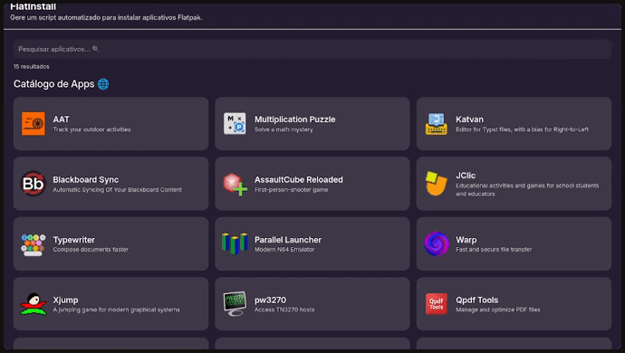

# FlatInstall


## 📚 Visão geral

Site estático que gera um script automatizado para instalar aplicativos Flatpak.

## 📷 Screenshots



## ✨ Funcionalidades

- Busca de aplicativos com fuzzy search (`fuse.js`)
- Geração automática de script Bash para instalação via Flatpak
- Cópia do script para a área de transferência
- Internacionalização com `i18next` (`en` e `pt`)

## 🚀 Como executar localmente

### Pré-requisitos

- Node.js 22+

### Instalação

```bash
npm ci
```

### Ambiente de desenvolvimento

```bash
npm run dev
```

### Build de produção

```bash
npm run build
```

### Preview do build

```bash
npm run preview
```

## 📝 Licença

Esse projeto está sob licença MIT. Veja o arquivo [LICENÇA](LICENSE.md) para mais detalhes.